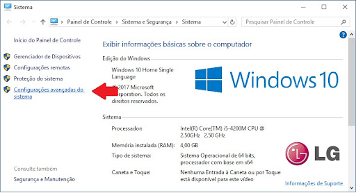

<h1 align="left">  #Lista de Tarefas-2: Um mergulho em Lógica de Programação com JavaScript </h1>

<h2>Introdução</h2>

A lista de exercícios 2 consiste em 50 desafios de Lógica com Javascript que contemplam todo o conteúdo abordado no módulo 01.

<h2>Configuração do Ambiente</h2>


<p>Antes de começar, certifique-se de ter o Node.js instalado em sua máquina. Você pode baixá-lo e instalá-lo a partir do <a href="https://nodejs.org/en/"> site oficial do Node.js.</a></p>

<h3>Instalando Node JS no Windows</h3>

<p>Execute o instalador baixado no site oficial do node, siga as instruções na tela e pronto, o Node está instalado e adicionado ao PATH do Windows. Feche todos os terminais abertos e você está pronto para prosseguir. Para verificar a versão do Node ou se ele foi instalado corretamente basta executar o seguinte comando: </p>

```
node --version ou node -v
```

<h4>Caso o node não seja reconhecido</h4>
<ul>Acesse: 
<li>Painel de Controle / Sistema e Segurança / Sistema / Configurações Avançadas do Sistema</li>


<li>Propriedades do Sistema</li>
Clique no botão -> Variáveis de Ambiente


<li>Varáveis de Ambiente:</li>
- Clique na variável Path e depois em editar.


Depois disso é só clicar em novo e adicionar caminho.


Um exemplo de como pegar o caminho para adicionar no Path, basta apenas copiar o caminho desejado:


No caso do node poderia ser: 
<p>C:\Program Files\nodejs</p>
Depois é só clicar ok em todas as janelas.
</ul>

<p>Depois é abrir o terminal e verificar a versão instalada com os seguintes comandos: </p>

```
node --version ou node -v
```


<h3>Instalando pacotes com NPM</h3>
<p>O NPM é o gerenciador de pacotes do Node que vem junto em sua instalação. Para verificar a versão do NPM instalada, você pode executar o seguinte comando:</p>

```
npm --version ou npm -v
```

<h4>Utizando prompt-sync</h4>
<p>O prompt-sync é um módulo para Node.js que permite solicitar entradas do usuário. Para instalá-lo basta digitar o seguinte comando no terminal:</p>

```
npm install prompt-sync
```

Para utilizá-lo num arquivo js para entrada de dados, use no início do arquivo a seguinte linha de código:

```
const prompt = require('prompt-sync')();
```

<h2>Executando os Exercícios</h2>

1- Caso você tenha o git instalado e saiba usá-lo, Clone este repositório em sua máquina local usando o seguinte comando:
```
git clone <url do repositório>
```
Mas se você não tiver o git, basta apenas acessar o repositório, depois clicar num botão verde chamado Code, e clicar na opção download zip. O arquivo compactado será baixado em sua máquina. Basta apenas descompactar e usá-lo. A imagem mostra o procedimento.


2- Navegue até o diretório do projeto:
```
cd seu-repositorio
```
3- Instale o prompt-sync na pasta do projeto para entrada de dados usando o seguinte comando:
```
npm install prompt-sync
```
4- Cada exercício está localizado em seu próprio arquivo JavaScript com o numero respectivo a cada questão. Abra o arquivo do exercício que deseja executar em seu editor de código preferido.

5- Abra um terminal na pasta do projeto e execute o arquivo JavaScript usando o Node.js. Por exemplo, para executar o exercício "exec_1.js", use o seguinte comando:
```
node exec_1.js
```
6- O resultado do exercício será exibido. 

Exibindo resultado no terminal do Visual Studio Code:

<video src="img/exec-terminal.mp4"  controls></video>

Caso deseje usar o cmd do windows:

<video src="img/exec_terminal_2.mp4" controls></video>

<h2><strong>Enuciado dos Desafios</strong></h2>

<h2>Desafio 1</h2>

Escreva um programa para calcular a redução do tempo de vida de um fumante.
Pergunte a quantidade de cigarros fumados por dias e quantos anos ele já fumou.
Considere que um fumante perde 10 min de vida a cada cigarro. Calcule quantos dias de
vida um fumante perderá e exiba o total em dias.

<h2>Desafio 2</h2>

Escreva um programa que pergunte a velocidade de um carro. Caso ultrapasse 80 Km/
h, exiba uma mensagem dizendo que o usuário foi multado. Nesse caso, exiba o valor da
multa, cobrando R$ 5,00 por cada Km acima da velocidade permitida.

<h2>Desafio 3</h2>

Faça um algoritmo que pergunte a distância que um passageiro deseja percorrer em
Km. Calcule o preço da passagem, cobrando R$ 0.50 por Km para viagens até 200 Km e
R$ 0.45 para viagens mais longas.

<h2>Desafio 4</h2>

Crie um programa que leia o tamanho de três segmentos de reta. Analise seus
comprimentos e diga se é possível formar um triângulo com essas retas.
Matematicamente, para três segmentos formarem um triângulo, o comprimento de cada
lado deve ser menor que a soma dos outros dois.

<h2>Desafio 5</h2>

Crie um jogo de JoKenPo (Pedra-Papel-Tesoura).

<h2>Desafio 6</h2>

Crie um jogo onde o computador vai sortear um número entre 1 e 5. O jogador vai
tentar descobrir qual foi o valor sorteado.

<h2>Desafio 7</h2>

Uma empresa de aluguel de carros precisa cobrar pelos seus serviços. O aluguel de um
carro popular custa R$ 90,00 por dia e um carro de luxo custa R$ 150,00. Além disso, o
cliente paga por Km percorrido. Faça um programa que leia o tipo de carro alugado
(popular ou luxo), quantos dias de aluguel e quantos Km foram 
percorridos. No final,
mostre o preço a ser pago de acordo com os dados a seguir:
Carros populares
- Até 100 Km percorridos: R$ 0,20 por Km
- Acima de 100 Km percorridos: R$ 0,10 por Km
Carros de luxo
- Até 200 Km percorridos: R$ 0,30 por Km
- Acima de 200 Km percorridos: R$ 0,25 por Km

<h2>Desafio 8</h2>

Um programa de vida saudável quer dar pontos por atividades físicas realizadas que
podem ser trocados por dinheiro. Cada hora de atividade física no mês vale pontos. 

O sistema funciona assim:
- até 10 h de atividade no mês: ganha 2 pontos por hora
- de 10 h até 20 h de atividade no mês: ganha 5 pontos por hora
- acima de 20 h de atividade no mês: ganha 10 pontos por hora
- A cada ponto ganho, o cliente fatura R$ 0,05 (5 centavos)

Faça um programa que leia quantas horas de atividade uma pessoa teve por mês.
Calcule e mostre quantos pontos ela teve e quanto dinheiro ela conseguiu ganhar.


<h2>Desafio 9</h2>

Desenvolva um aplicativo que leia o salário e o sexo de vários funcionários. No final,
mostre o total de salário pago aos homens e o total pago às mulheres. O programa vai
perguntar ao usuário se ele quer continuar ou não sempre que ler os dados de um
funcionário.

<h2>Desafio 10</h2>

Crie um programa usando a estrutura “faça enquanto” que leia vários números. A
cada laço, pergunte se o usuário quer continuar ou não. No final, mostre na tela:

a) O somatório entre todos os valores;

b) Qual foi o menor valor digitado;

c) A média entre todos os valores;

d) Quantos valores são pares.

<h2>Desafio 11</h2>

Desenvolva um programa que leia o primeiro termo e a razão de uma PA (Progressão
Aritmética), mostrando na tela os 10 primeiros elementos da PA e a soma entre todos os
valores da sequência.

<h2>Desafio 12</h2>

Faça um programa que mostre os 10 primeiros elementos da Sequência de Fibonacci.
Ex.: 1, 1, 2, 3, 5, 8, 13, 21.

<h2>Desafio 13</h2>

Crie um programa que preencha automaticamente (usando lógica, não apenas
atribuindo diretamente) um vetor numérico com 15 posições com os primeiros elementos
da sequência de Fibonacci.

<h2>Desafio 14</h2>

Faça um programa que leia 7 nomes de pessoas e guarde-os em um vetor. No final,
mostre uma listagem com todos os nomes informados, na ordem inversa daquela em
que eles foram informados.

<h2>Desafio 15</h2>

Desenvolva um programa que leia 10 números inteiros e guarde-os em um vetor. No
final, mostre quais são os números pares que foram digitados e em que posições eles
estão armazenados.

<h2>Desafio 16</h2>

Crie uma lógica que preencha um vetor de 20 posições com números aleatórios
(entre 0 e 99) gerados pelo computador. Logo em seguida, mostre os números gerados e
depois coloque o vetor em ordem crescente, mostrando no final os valores ordenados.

<h2>Desafio 17</h2>

Crie um programa que leia o nome e a idade de 9 pessoas e guarde esses valores em
dois vetores, em posições relacionadas. No final, mostre uma listagem contendo apenas
os dados das pessoas menores de idade.

<h2>Desafio 18</h2>

Crie um registro com o nome do funcionário, cargo e salário. Leia este registro para
um funcionário e ao final escreva o conteúdo do registro

<h2>Desafio 19</h2>

Escrever um programa para ler 5 horários. Validar cada horário fornecendo através de
repetição. Escrever cada um deles no formato HH.MM.SS.

<h2>Desafio 20</h2>

Uma indústria faz a folha mensal de pagamentos de seus 80 empregados baseada
no seguinte: existe uma tabela com os dados de cada funcionalidade: matrícula, nome e
salário bruto. Escreva um programa que leia e processe a tabela e emita (escreva na
tela), cada funcionário, seu contracheque, cujo formato é dado a seguir:

Matrícula:

Nome:

Salário bruto:

Dedução INSS:

Salário líquido:

(Dicas: desconto de 12%, salário líquido é a diferença entre salário bruto e a redução do
INSS).

<h2>Desafio 21</h2>

Faça uma função que recebe, por parâmetro, a altura (alt) e o sexo de uma pessoa e
retorna o seu peso ideal. Para homens, calcular o peso ideal usando a fórmula: peso ideal
= 72.7 x alt - 58 e, para mulheres, peso ideal = 62.1 x alt - 44.7.

<h2>Desafio 22</h2>

A prefeitura de uma cidade fez uma pesquisa entre os seus habitantes, coletando
dados sobre o salário e número de filhos. Faça uma função que leia esses dados para um
número não determinado de pessoas e retorne a média de salário da população, a média do 
número de filhos, o maior salário e o percentual de pessoas com salário até R$
350,00.

<h2>Desafio 23</h2>

Criar e imprimir a matriz identidade MI[1..7,1..7] em que todos os elementos da
diagonal principal são iguais a 1 e os demais são nulos.

<h2>Desafio 24</h2>

Dada uma matriz M[1..6,1..8], criar um vetor C que contenha, em cada posição, a
quantidade de elementos negativos da linha correspondente de M.

<h2>Desafio 25</h2>

Faça um algoritmo que leia uma matriz de 15 X 20 de números reais e mostre a soma
de cada coluna separadamente.

<h2>Desafio 26</h2>

Dadas duas matrizes numéricas A[1..3,1..5] e B[1..3,1..5], calcular a matriz produto
P[1..3,1..5].

<h2>Desafio 27</h2>

Elaborar um algoritmo que leia uma matriz M(6,6) e um valor A. Após a leitura,
multiplicar a matriz M pelo valor A e colocar os valores da matriz multiplicados por A em
um vetor V(36). Escrever o vetor V no final.

<h2>Desafio 28</h2>

Fazer um algoritmo para receber uma matriz 10 x 10 e devolver o resultado pedido no item:

a) a soma dos elementos acima da diagonal principal;

b) a soma dos elementos abaixo da diagonal principal;


<h2>Desafio 29</h2>

Escreva um algoritmo que leia uma matriz M(5,5) e calcule as somas:

a) da linha 4 de M;

b) da coluna 2 de M;

c) da diagonal principal;

d) todos os elementos da matriz M.

Escrever essas somas e a matriz.

<h2>Desafio 30</h2>

Escrever um algoritmo que lê uma matriz M(5,5) e cria 2 vetores SL(5) e SC(5) que
contenham, respectivamente, as somas das linhas e das colunas de M. Escrever a matriz
e os vetores criados.

<h2>Desafio 31</h2>

Escreva um algoritmo que leia um número inteiro A e uma matriz V 30 x 30 de inteiros.
Conte quantos valores iguais a A estão na matriz. Crie, a seguir, uma matriz X contendo
todos os elementos de V diferentes de A. Mostre os resultados.

<h2>Desafio 32</h2>

Escrever um algoritmo que lê uma matriz M(12,13) e divida todos os 13 elementos de
cada uma das 12 linhas de M pelo maior elemento em módulo daquela linha. Escrever a
matriz lida e a modificada.

<h2>Desafio 33</h2>

Faça um algoritmo que leia uma matriz 3 x 3 e após a leitura, multiplique os
elementos da diagonal principal com a média dos elementos da diagonal secundária.

<h2>Desafio 34</h2>

Faça um algoritmo que leia uma matriz 50 x 50 de números reais. A seguir, multiplique
cada linha pelo elemento da diagonal principal daquela linha. Mostre a matriz após as
multiplicações.

<h2>Desafio 35</h2>

Elaborar um algoritmo que leia um conjunto de 30 valores e os coloca em 2 vetores
conforme forem pares ou ímpares. O tamanho do vetor é de 5 posições. Se algum vetor
estiver cheio, escrevê-lo. Terminada a leitura, escrever o conteúdo dos dois vetores. Cada
vetor pode ser preenchido quantas vezes forem necessárias.

<h2>Desafio 36</h2>

Escreva um algoritmo que leia um vetor de 13 elementos inteiros, que é o Gabarito de
um teste da loteria esportiva. Leia, a seguir, para cada um dos 100 apostadores, o número
do seu cartão e um vetor de Respostas de 13 posições. Verifique para cada apostador o
número de acertos, comparando o vetor de Gabarito com o vetor de Respostas. Escreva
o número do apostador e o número de acertos. Se o apostador tiver 13 acertos, mostrar a
mensagem "Parabéns, tu foi o GANHADOR".

<h2>Desafio 37</h2>

Escreva um algoritmo que leia um vetor G de 20 elementos caractere que representa
o gabarito de uma prova. A seguir, para cada um dos 50 alunos da turma, leia o vetor de
respostas (R) do aluno e conte o número de acertos. Mostre o número de acertos do
aluno e uma mensagem “APROVADO” se a quantidade de acertos for maior ou igual a 12;
e mostre uma mensagem de “REPROVADO”, caso contrário.

<h2>Desafio 38</h2>

Elabore um algoritmo que leia um vetor de 6 posições e após sua leitura leia outra
variável identificadora que calcule a operação conforme a informação contida nesta variável:

1- soma dos elementos;

2- produto dos elementos;

3- média dos elementos;

4- ordene os elementos em ordem crescente;

5- mostre o vetor.

<h2>Desafio 39</h2>

Faça um algoritmo que leia um vetor (A) de 100 posições. Em seguida, compacte o
vetor, retirando os valores nulos e negativos. Coloque o resultado no vetor B.

<h2>Desafio 40</h2>

Faça um algoritmo que leia um vetor de 5 elementos inteiros, correspondentes ao
resultado oficial da Loto. A seguir, leia 50 conjuntos de vetores (com 5 elementos inteiros
cada), representando as apostas feitas. Compare os números das apostas com o
resultado oficial e mostre uma mensagem ("Ganhador") se todos os números
corresponderem ao resultado oficial. (Observação: não é necessário procurar por ternos
e quadras, apenas por quinas.)

<h2>Desafio 41</h2>

Dado o objeto pessoa com propriedades nome e idade, acesse e imprima o valor de
idade. Adicione uma nova propriedade chamada email ao objeto pessoa que já possui
nome e idade.

<h2>Desafio 42</h2>

Crie um objeto chamado dados que contém várias propriedades, incluindo números,
strings e arrays. Escreva uma função que retorne um novo objeto apenas com as
propriedades que são arrays.

<h2>Desafio 43</h2>

Dado dois objetos, obj1 e obj2, escreva uma função que crie um novo objeto
combinando as propriedades de ambos, onde as propriedades de obj2 têm precedência
sobre as do obj1 em caso de conflitos.

<h2>Desafio 44</h2>

Escreva uma função que conte quantas propriedades do tipo string existem em um
objeto e retorne esse número.

<h2>Desafio 45</h2>

Dado um array de strings, crie um objeto onde cada string é uma chave, e seu valor é
o número de vezes que a string aparece no array.

<h2>Desafio 46</h2>

Suponha que você tem um array de objetos onde cada objeto representa uma venda
com vendedor e valor. Escreva uma função que retorne um objeto que sumarize o total
de vendas por vendedor.

<h2>Desafio 47</h2>

Crie uma função que transforme um objeto de entrada aplicando uma função
fornecida a cada uma das propriedades do objeto, retornando um novo objeto com os
resultados

<h2>Desafio 48</h2>

Você recebe dois objetos que representam o inventário de duas lojas diferentes:
inventarioLojaA e inventarioLojaB. Cada chave é um item, e o valor é a quantidade desse
item em estoque. Escreva uma função que combine os inventários em um único objeto.
Se um item aparecer em ambas as lojas, some as quantidades.

<h2>Desafio 49</h2>

Você recebe um array de objetos representando transações financeiras. Cada
transação possui id, valor, data, e categoria. Escreva uma função que retorne um objeto
onde as chaves são as categorias, e os valores são arrays de transações pertencentes a
essa categoria. Adicionalmente, inclua um subtotal de valores por categoria.

<h2>Desafio 50</h2>

Desenvolva um pequeno sistema de reserva de hotéis usando JavaScript. O sistema
deverá ser capaz de interagir com o usuário através do console do navegador e manter
um registro das reservas e hotéis disponíveis. Utilize objetos e arrays para gerenciar as
informações. Não é necessário interface gráfica, apenas funcionalidade lógica.
1. Estrutura de Dados:
○ Hotel: Cada hotel deve ser um objeto com propriedades para id, nome,
cidade, quartos totais e quartos disponiveis.
○ Reservas: Cada reserva deve ser um objeto contendo idReserva, idHotel, e
nomeCliente.
2. Funcionalidades:
○ Adicionar hotéis: Permitir que o usuário adicione novos hotéis ao sistema.
○ Buscar hotéis por cidade: Permitir que o usuário liste todos os hotéis
disponíveis em uma cidade específica.
○ Fazer reserva: Permitir que um usuário faça uma reserva em um hotel. Isso
deve diminuir o número de quartos disponiveis do hotel.
○ Cancelar reserva: Permitir que um usuário cancele uma reserva. Isso deve
aumentar o número de quartos disponiveis no hotel correspondente.
○ Listar reservas: Mostrar todas as reservas, incluindo detalhes do hotel e do
cliente.
3. Regras de Negócio:
○ Um hotel só pode aceitar reservas se houver quartos disponíveis.
○ As reservas devem ser identificadas por um ID único e associadas a um
único hotel.
4. Desafios Adicionais (Opcionais):
○ Implementar uma função de check-in e check-out que atualize a
disponibilidade de quartos.
○ Gerar relatórios de ocupação para um hotel.
○ Permitir que o usuário avalie o hotel após a estadia, e armazenar essas
avaliações dentro do objeto do hotel.


<h2>Desenvolvedor</h2>

[<br><sub>Michel L. Sampaio</sub>](https://github.com/devlavanere)